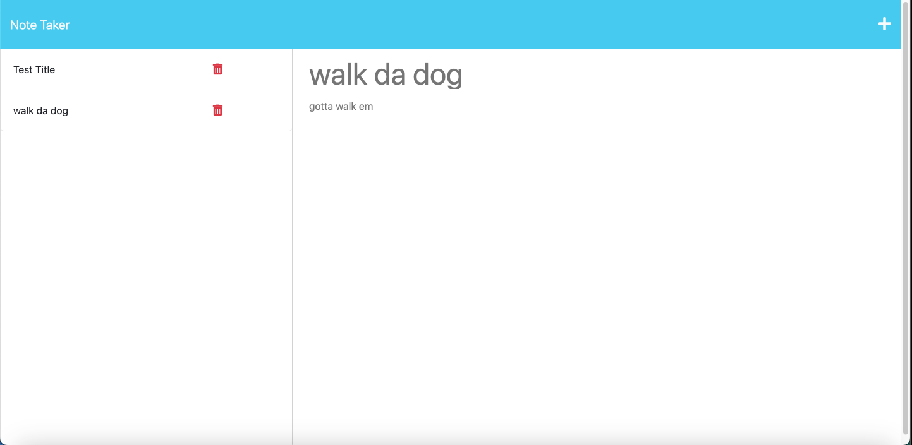

# Note-Taker-Express
## Tabke of Contents
[Contact Me](#questions)
[Description](#description)
[Installation](#installation)
[Usage](#usage)
[License](#license)
[Test](#test)

## Description
    Its a note taker that was built using express.js and it is deployed using heroku. It saves notes.
## Installation
    You just go to the website. https://notetaker-mc-c893b6adb7f0.herokuapp.com/notes
## Usage

## Credits
    UM Coding Bootcamp and W3 Schools
## License
    This project is licensed under the MIT license.
## How to Contribute
    You can download the file off github and make changes and you can make your own version of it. Please email me your version if you make any changes
## Tests
    It took a couple tries to get it deployed and working correctly
## Questions
    https://github.com/mariencito
    You can email me at mariencastellanosjr@gmail.com